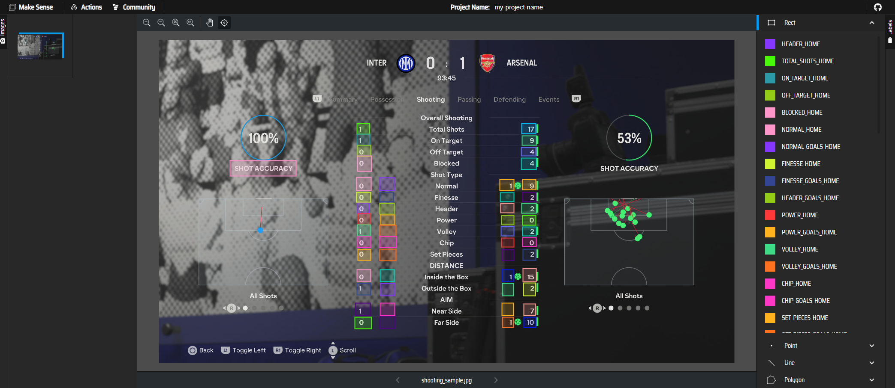
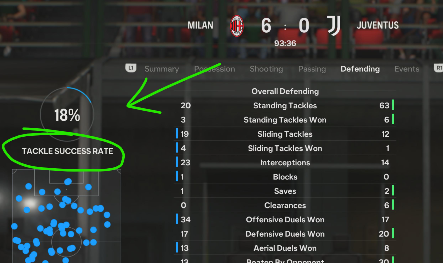
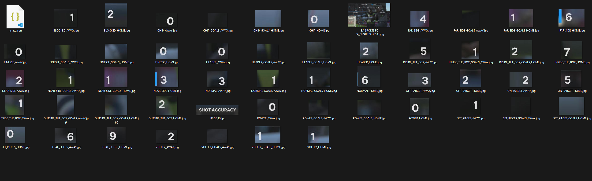

# Fifa Stat Extractor

## Problem

FIFA (or now EA Sports FC) does not provide an API for developers to analyze match stats. You can view your player statistics in-game, but those are already aggregated and while interesting to look at, they don't satisfied my data craving.

At the time of writing this, no solution exists to this problem that I know of. Please feel free to correct me - I'd love to compare what's out there.

## Solution

This is an attempt at scraping match statistics from EA SPORTS FC 'Match Facts' screen. The data is saved into JSON and CSV formats and can be later picked up to be ingested further. For example, I upload CSVs directly to BigQuery for analysis.

## Prerequisites

- 'Match facts' screenshots (I've provided [test images](tests/test-data) in this repo for quickstart)
- Ready to use USB pendrive
- Access to [`Docker`](https://www.docker.com/) environment

## Supported platforms

The listed configuration has been tested and should work everywhere.


- Games:
    - EA Sports FC 2024

I'm hoping the Match Facts remains fairly static, Looking at [FIFA 23](https://platform.polygon.com/wp-content/uploads/sites/2/chorus/uploads/chorus_asset/file/24081980/FIFA_23_20221004120157.jpg?quality=90&strip=all&crop=0%2C0%2C100%2C100&w=750) stats, there's a chance this structure is retained in the next generation. Although I already see some differences between 23 and 24, so I'm expecting the pixel bounding boxes will have to be updated 

- Consoles:
    - PS5

If the 'Match Facts' screen differs based on the platform you're running the game on (Xbox, PS, PC), [additional annotations](annotation-export) would have to be added to support that.

- Resolution:
    - 3840x2160 px

For 16:9 screens, so the vast majority, supporting different resolutions could be as easy as dividing/multiplying the existing bounding box coordinates, but this will have to be proven to be true.


## Quickstart

```bash
cd ~
git clone git@github.com:pflajszer/fifa-stat-extractor.git

# the below steps just ensure you have the right folder structure (container will mount your FIFA_WORKDIR and work in its boundries)
mkdir -p fifa-stats/source_data
export FIFA_WORKDIR="/home/$USER/fifa-stats/"

# copy test data (this would normally be where you save your screenshots)
cp fifa-stat-extractor/tests/test-data/* fifa-stats/source_data

# run the extractor (this will build & run the container)
cd fifa-stat-extractor
make run 

ls $FIFA_WORKDIR/jobs/*
```

The last command will list contents of `jobs` folder. Each time you use `make run`, there should be a new folder generated in `jobs` based on current datetime in format `YYYY-mm-DD-HH-MM-SS` containing all job outputs.

## Output

Job output contains data with different levels of granularity.

You're mostly interested in the following files:
- SUMMARY.csv
- SHOOTING.csv
- PASSING.csv
- DEFENDING.csv
- session_stats.json

Where `*.csv` files are split by their corresponding stat type and `*.json` file is all-stats-in-one.

All the folders in the output are mostly post-processing remnants, but they might come in handy when debugging and fine tuning - they contain source image and all sliced images based on the bounding boxes we extracted)

## Workflow

It's recommended to start with [quickstart](#quickstart) to understand how the script itself works before continuing to the below steps. 

1. Play a match
1. After the match is finished, go to Match Facts
1. [Take a screenshot](https://www.playstation.com/en-us/support/games/capture-ps5-gameplay-screenshots/#capture) on each of the pages:
    - Summary
    - Shooting
    - Passing
    - Defending
1. You can play as many matches as you want - as long as you've been taking screenshots of the required pages
1. When the time comes you'd like to extract your stats, plug your USB drive in the console, select your screenshots and [Copy to USB Drive](https://www.playstation.com/en-us/support/games/ps5-media-gallery-view-screenshots/#usb)
1. Transfer them to your `source_data` folder, just like you did in the [quickstart](#quickstart)
1. navigate to your cloned repo (again, you did that in quickstart)
1. ensure you have `FIFA_WORKDIR` env var pointing to the folder containing `source_data` directory. Best practice would be adding it to your `./bashrc` (or equivalent) file.
1. run `make run` command.
1. Your `jobs` directory in `FIFA_WORKDIR` should now have the results in.

> Warning: when taking screenshots, ensure all numbers are on a reasonably dark background)


## Devcontainer

To run via devcontainer, follow [this tutorial](https://code.visualstudio.com/docs/devcontainers/tutorial) to set your environment

You'll also notice that `FIFA_WORKDIR` env var is used in `devcontainer.json` under mounts. This means you should have this defined in the shell instance bulding the container, which I'm not sure how to do other than just adding it to your `./bashrc` file.

## Implementation details

### Premise

The premise of this script is that Match Facts screen stats are always at the same matrix pixel coordinates - this means that, instead of trying to read the entire page and go through a difficult task of figuring out which number denotes which statistic (and worry about their order etc), we can use labelling software like [Makesense.ai](https://www.makesense.ai/) to label the bounding boxes and treat them as constant for every image. More on that in [text annotation section](#text-annotation)

### Text annotation

We use annotations to take note of:
- Matrix coordinates of a given [stat type](#stat-types) and bounding box dimensions
- Name of the statistic the bounding box contains

I have used [Makesense.ai](https://www.makesense.ai/) to annotate example screenshots - you can find the results in [annotation-export folder](annotation-export).

Each [page type](#page-types) is annotated separately.

This is how the annotated page looks like:



You can re-import each of the items to improve, by:

1. go to https://www.makesense.ai/
1. start new project
1. upload example `*.jpg` image from [annotation-export folder](annotation-export) (inside {version}/{page_type} subfolders)
1. Choose 'Object detection'
1. skip annotation import when they ask for it (doesn't allow choosing type of import)
1. actions (top left) > import annotations > "Multiple files in VOC XML format"
1. select the .XML file from the same folder as your image
1. make edits
1. do for all export types: actions > export annotations > select type > export
1. unzip zipped annotations (txt and xml) to match the structure of the existing version
1. replace existing configuration in `ps5-fc24-3840x2160` directory if you improved it, or if you've created a configuration for a different platform/game version/resolution, create a folder alongside matching the naming convention.


### Page types

**Stat page** - a category/grouping of which we get stats for (i.e. `Defending`).

Since we take 4 screenshots (4 stat pages), we also have to have means of distinguishing which page we're reading - SUMMARY, SHOOTING, PASSING or DEFENDING. This is done using what I called a PAGE_ID and it's simply the top-left 'summarizing' stat:



In this example, if this bounding box extracted text is "TACKLE SUCCESS RATE", we derive the page type is "DEFENDING".

> Note: the rest of the stats aren't tabular, but rather timeline-based. Therefore, they're much harder to extract programatically.

### Stat types

**State type** - an individual statistic (i.e. `Standing Tackles`).

As shown before, each stat will have it's own bounding box and label denoting which stat it is.
Individual images are also saved in your job folder inside individual match directories:




### Text extraction

Text extraction is done separately for each stats, since we used the bounding boxes to 'slice' each image and labeled with the stat name, as shown in [stat types section](#stat-types).

We extract text using [easyocr](https://github.com/JaidedAI/EasyOCR)

## Limitations & Known issues

### USB transfer bottleneck

I wanted to avoid a manual task of transferring data back and forth using USB drive and initially the workflow was different.

I used to transfer screenshots to PS App (another option next to Copy to USB Drive), but that's a first limitation: you can't select more than 4 media items when doing that - that's major for us, since that's a single game!

Then, in PS App on my mobile, I'd select those and press 'Download' to my device - sadly, again, only 4 at a time.

The screenshots would land in Ps App folder on my device which was backed up to OneDrive and that was my mounted directory for this script. That step also wasn't perfect - OneDrive sync was laggy.

Unfortunately, this solution wasn't possible. Copy to USB is much better - select as many as you want (+ 'select all' option), transfer directly to the directory you want it in, and done.

### Hallucinations & blanks

EasyOCR, while great and simple to use, also has some limitations. In majority of cases the background is well-contrasting with the text (this is also something we should ensure when taking screenshots). Even then, the model makes mistakes - you'll see occasional blank values and hallucinations.

To tackle blanks, I've made the model setup VERY forgiving. Here are params I used in text extraction [readtext method](https://www.jaided.ai/easyocr/documentation/):
```
text_threshold=0.01,
low_text=0.1,
```
Because of that, we'll have less blanks, but some hallucinations might happen - I'm not yet sure how wide of a problem that is.

For all stats outside of team names, we also only allow characters: `0123456789.:%` to be recognized.


## Support

This project is under constant development, so if you have any queries, feel free to raise an issue and I'll try to help as much as I can.

## Contributing

This repo is open for any improvements. If you think you can help - please get in touch or submit a PR!